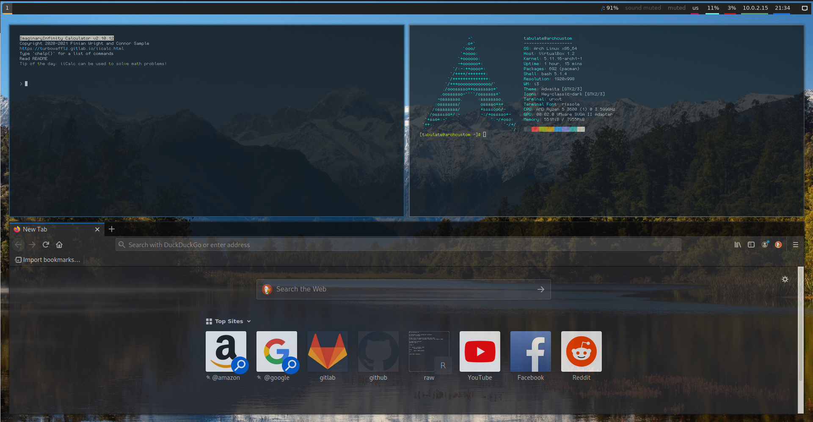

# i3-dotfiles
My Arch Linux i3 Dotfiles

Terminal: URxvt

Terminal Font: [Rissole](https://addy-dclxvi.github.io/post/bitmap-fonts/)

WM: i3-gaps

DM: ly

Default Shell: bash

URxvt Shell: fish

Icon Pack: [Hey icons dark](https://store.kde.org/p/1330383/)

Calculator: [ImaginaryInfinity Calculator](https://gitlab.com/TurboWafflz/ImaginaryInfinity-Calculator)

File manager: Nemo

Background: File named `desktop.jpg` in home directory

